# Diagrama de Clases — Apptism

## Arquitectura general

El proyecto sigue una arquitectura en **cuatro capas** típica de Spring Boot + JavaFX:

```
Controladores JavaFX  →  Servicios  →  Repositorios  →  Entidades JPA
```

---

## Diagrama de clases

```mermaid
classDiagram

    %% ══════════════════════════════════════
    %%  ENUMERACIONES
    %% ══════════════════════════════════════

    class RolUsuario {
        <<enumeration>>
        NINO
        PADRE
        PROFESOR
        ADMIN
    }

    class CategoriaTarea {
        <<enumeration>>
        MATEMATICAS
        LENGUA
        ARTE
        JUEGO
        HABITOS
    }

    class Emocion {
        <<enumeration>>
        FELIZ
        TRISTE
        ENFADADO
        MIEDO
        CALMA
        IRA
    }

    class TipoMensaje {
        <<enumeration>>
        EMOCION
        CHAT
    }

    class EstadoSolicitud {
        <<enumeration>>
        PENDIENTE
        APROBADA
        RECHAZADA
    }

    class ZonaHoraria {
        <<enumeration>>
        MANANA
        MEDIODIA
        NOCHE
    }

    %% ══════════════════════════════════════
    %%  ENTIDADES JPA
    %% ══════════════════════════════════════

    class Usuario {
        <<Entity>>
        -Long id
        -String email
        -String password
        -RolUsuario rol
        -String nombre
        -LocalDate fechaNacimiento
        -Integer puntosAcumulados
        -List~Usuario~ ninos
        -List~Rutina~ rutinas
        -List~Tarea~ tareas
    }

    class Tarea {
        <<Entity>>
        -Long id
        -String titulo
        -String descripcion
        -CategoriaTarea categoria
        -Integer puntosPorCompletar
        -boolean completada
        -LocalDateTime fechaProgramada
    }

    class Rutina {
        <<Entity>>
        -Long id
        -String nombre
        -ZonaHoraria zonaHoraria
        -String pictogramaUrl
        -boolean completada
        -Integer orden
        -List~PasoRutina~ pasos
    }

    class PasoRutina {
        <<Entity>>
        -Long id
        -String descripcion
        -String pictogramaUrl
        -Integer orden
        -boolean completado
    }

    class Recompensa {
        <<Entity>>
        -Long id
        -String descripcion
        -Integer puntosNecesarios
        -String pictogramaUrl
        -boolean activa
    }

    class SolicitudCanje {
        <<Entity>>
        -Long id
        -EstadoSolicitud estado
        -boolean leida
        -LocalDateTime fecha
    }

    class Mensaje {
        <<Entity>>
        -Long id
        -String pictogramaUrl
        -String textoPictograma
        -TipoMensaje tipo
        -boolean leido
        -LocalDateTime fecha
    }

    class RegistroEmocional {
        <<Entity>>
        -Long id
        -Emocion emocion
        -Integer intensidad
        -LocalDateTime fecha
    }

    %% ══════════════════════════════════════
    %%  REPOSITORIOS
    %% ══════════════════════════════════════

    class UsuarioRepository {
        <<Repository>>
        +findByEmail(String) Optional~Usuario~
        +findByEmailAndPassword(String, String) Optional~Usuario~
        +findByRol(RolUsuario) List~Usuario~
    }

    class TareaRepository {
        <<Repository>>
        +findByNinoId(Long) List~Tarea~
        +findByNinoIdAndCompletada(Long, boolean) List~Tarea~
        +findByCreadorId(Long) List~Tarea~
        +findTareasEnRango(Long, LocalDateTime, LocalDateTime) List~Tarea~
    }

    class RutinaRepository {
        <<Repository>>
        +findByNinoIdOrderByOrdenAsc(Long) List~Rutina~
        +findByNinoIdAndZonaHorariaOrderByOrdenAsc(Long, ZonaHoraria) List~Rutina~
    }

    class PasoRutinaRepository {
        <<Repository>>
        +findByRutinaIdOrderByOrdenAsc(Long) List~PasoRutina~
    }

    class RecompensaRepository {
        <<Repository>>
        +findByFamiliaIdAndActivaTrue(Long) List~Recompensa~
        +findByActivaTrue() List~Recompensa~
        +findByPuntosNecesariosLessThanEqual(Integer) List~Recompensa~
    }

    class SolicitudCanjeRepository {
        <<Repository>>
        +findByRecompensaFamiliaIdOrderByFechaDesc(Long) List~SolicitudCanje~
        +countByRecompensaFamiliaIdAndLeidaFalse(Long) long
        +findByNinoIdAndEstado(Long, EstadoSolicitud) List~SolicitudCanje~
    }

    class MensajeRepository {
        <<Repository>>
        +findByEmisorIdAndReceptorId...OrderByFechaAsc(...) List~Mensaje~
        +findByReceptorIdAndTipoOrderByFechaDesc(Long, TipoMensaje) List~Mensaje~
        +countByReceptorIdAndLeidoFalse(Long) long
    }

    class RegistroEmocionalRepository {
        <<Repository>>
        +findByNinoIdOrderByFechaDesc(Long) List~RegistroEmocional~
        +findByNinoIdAndFechaAfter(Long, LocalDateTime) List~RegistroEmocional~
        +countByNinoIdAndEmocionAndFechaAfter(Long, Emocion, LocalDateTime) long
    }

    %% ══════════════════════════════════════
    %%  SERVICIOS
    %% ══════════════════════════════════════

    class UsuarioService {
        <<Service>>
        -UsuarioRepository usuarioRepository
        +login(String, String) Optional~Usuario~
        +getTodosLosTutores() List~Usuario~
        +getTodosLosNinos() List~Usuario~
        +getContactos(Usuario) List~Usuario~
        +getNinosDetutor(Long) List~Usuario~
        +getTutoresDeNino(Long) List~Usuario~
        +getTodosLosUsuarios() List~Usuario~
        +crearUsuario(String, String, String, RolUsuario) Usuario
        +vincularNinoATutor(Long, Long) void
        +eliminarUsuario(Long) void
        +actualizarPuntos(Long, int) Usuario
        +registrar(Usuario) Usuario
    }

    class TareaService {
        <<Service>>
        -TareaRepository tareaRepository
        -UsuarioRepository usuarioRepository
        +getTareasByNino(Long) List~Tarea~
        +getTareasPendientes(Long) List~Tarea~
        +crearTarea(String, String, int, Long, Long) Tarea
        +completarTarea(Long) int
        +eliminarTarea(Long) void
        +getTareasCreadasPor(Long) List~Tarea~
        +getTareasDeNinosDelTutor(Long) List~Tarea~
    }

    class RutinaService {
        <<Service>>
        -RutinaRepository rutinaRepository
        -UsuarioRepository usuarioRepository
        +getRutinasByZona(Long, ZonaHoraria) List~Rutina~
        +todasLasRutinas(Long) List~Rutina~
        +getRutinasPorZonaDeNinosDelTutor(Long, ZonaHoraria) List~Rutina~
        +getNinosDelTutor(Long) List~Usuario~
        +crearRutina(String, ZonaHoraria, Long) Rutina
        +crearRutina(String, ZonaHoraria, Long, Long) Rutina
        +marcarCompletada(Long) void
        +eliminarRutina(Long) void
    }

    class RecompensaService {
        <<Service>>
        -RecompensaRepository recompensaRepository
        -UsuarioRepository usuarioRepository
        -SolicitudCanjeRepository solicitudCanjeRepository
        +getRecompensasDisponibles(Long) List~Recompensa~
        +getTodasRecompensasActivas() List~Recompensa~
        +getRecompensasAccesibles(int) List~Recompensa~
        +crearRecompensa(String, int, Long) Recompensa
        +canjearRecompensa(Long, Long) boolean
        +eliminarRecompensa(Long) void
    }

    class SolicitudCanjeService {
        <<Service>>
        -SolicitudCanjeRepository solicitudRepo
        -UsuarioRepository usuarioRepo
        -RecompensaRepository recompensaRepo
        +solicitarCanje(Long, Long) SolicitudCanje
        +getSolicitudesTutor(Long) List~SolicitudCanje~
        +contarNoLeidas(Long) long
        +aprobar(Long) void
        +rechazar(Long) void
        +marcarTodasLeidas(Long) void
    }

    class MensajeService {
        <<Service>>
        -MensajeRepository mensajeRepository
        -UsuarioRepository usuarioRepository
        +enviarMensaje(Long, Long, String, String, TipoMensaje) Mensaje
        +getConversacion(Long, Long) List~Mensaje~
        +getEmocionesRecibidas(Long) List~Mensaje~
        +marcarLeidos(Long) void
        +contarNoLeidos(Long) long
    }

    class ArasaacService {
        <<Service>>
        -HttpClient client
        -ObjectMapper mapper
        -ConcurrentHashMap cache
        +getImagenUrl(int) String
        +buscar(String) List~PictogramaDTO~
        +getEmocionesBásicas() List~PictogramaDTO~
        +limpiarCache() void
    }

    %% ══════════════════════════════════════
    %%  CONTROLADORES JavaFX
    %% ══════════════════════════════════════

    class LoginController {
        <<Controller>>
        +$usuarioActivo : Usuario
        -UsuarioService usuarioService
        -StageManager stageManager
        +initialize() void
        +onLogin() void
    }

    class DashboardController {
        <<Controller>>
        -SolicitudCanjeRepository solicitudRepo
        -StageManager stageManager
        +initialize() void
        +onIrRutinas() void
        +onIrTareas() void
        +onIrChat() void
        +onIrRecompensas() void
        +onIrEmociones() void
        +onCerrarSesion() void
    }

    class TareasController {
        <<Controller>>
        -TareaService tareaService
        -RutinaService rutinaService
        -StageManager stageManager
        +initialize() void
        +onCrearTarea() void
        +onEliminarTarea() void
    }

    class RutinasController {
        <<Controller>>
        -RutinaService rutinaService
        -StageManager stageManager
        +initialize() void
        +onCrearRutina() void
    }

    class EmocionesController {
        <<Controller>>
        -ArasaacService arasaacService
        -MensajeService mensajeService
        -UsuarioService usuarioService
        -StageManager stageManager
        +initialize() void
    }

    class RegistroEmocionalController {
        <<Controller>>
        -MensajeService mensajeService
        -UsuarioService usuarioService
        -StageManager stageManager
        +initialize() void
    }

    class ChatController {
        <<Controller>>
        -MensajeService mensajeService
        -ArasaacService arasaacService
        -UsuarioService usuarioService
        -StageManager stageManager
        +initialize() void
        +onBuscar() void
    }

    class RecompensasController {
        <<Controller>>
        -RecompensaService recompensaService
        -UsuarioService usuarioService
        -StageManager stageManager
        +initialize() void
        +onCrearRecompensa() void
    }

    class SolicitudesCanjeController {
        <<Controller>>
        -SolicitudCanjeService solicitudService
        -StageManager stageManager
        +initialize() void
        +onAprobar() void
        +onRechazar() void
    }

    class AdminController {
        <<Controller>>
        -UsuarioService usuarioService
        -StageManager stageManager
        +initialize() void
        +onCrearUsuario() void
        +onEliminarUsuario() void
        +onVincular() void
    }

    %% ══════════════════════════════════════
    %%  RELACIONES — ENTIDADES
    %% ══════════════════════════════════════

    Usuario "1" --> "0..*" Usuario : tutores ↔ ninos (ManyToMany)
    Usuario "1" *-- "0..*" Rutina : tiene (nino)
    Usuario "1" *-- "0..*" Tarea  : asignada a (nino)
    Rutina  "1" *-- "0..*" PasoRutina : contiene
    Usuario "1" --> "0..*" Tarea      : crea (creador)
    Usuario "1" --> "0..*" Rutina     : crea (creador)
    Usuario "1" --> "0..*" Recompensa : crea (familia/tutor)
    Usuario "1" --> "0..*" SolicitudCanje : solicita (nino)
    SolicitudCanje "0..*" --> "1" Recompensa : referencia
    Usuario "1" --> "0..*" Mensaje : emite (emisor)
    Usuario "1" --> "0..*" Mensaje : recibe (receptor)
    Usuario "1" *-- "0..*" RegistroEmocional : registra (nino)

    Usuario        ..> RolUsuario
    Tarea          ..> CategoriaTarea
    Mensaje        ..> TipoMensaje
    SolicitudCanje ..> EstadoSolicitud
    RegistroEmocional ..> Emocion
    Rutina         ..> ZonaHoraria

    %% ══════════════════════════════════════
    %%  RELACIONES — SERVICIOS / REPOSITORIOS
    %% ══════════════════════════════════════

    UsuarioService      --> UsuarioRepository
    TareaService        --> TareaRepository
    TareaService        --> UsuarioRepository
    RutinaService       --> RutinaRepository
    RutinaService       --> UsuarioRepository
    RecompensaService   --> RecompensaRepository
    RecompensaService   --> UsuarioRepository
    RecompensaService   --> SolicitudCanjeRepository
    SolicitudCanjeService --> SolicitudCanjeRepository
    SolicitudCanjeService --> UsuarioRepository
    SolicitudCanjeService --> RecompensaRepository
    MensajeService      --> MensajeRepository
    MensajeService      --> UsuarioRepository

    UsuarioRepository         ..> Usuario         : gestiona
    TareaRepository           ..> Tarea           : gestiona
    RutinaRepository          ..> Rutina          : gestiona
    PasoRutinaRepository      ..> PasoRutina      : gestiona
    RecompensaRepository      ..> Recompensa      : gestiona
    SolicitudCanjeRepository  ..> SolicitudCanje  : gestiona
    MensajeRepository         ..> Mensaje         : gestiona
    RegistroEmocionalRepository ..> RegistroEmocional : gestiona

    %% ══════════════════════════════════════
    %%  RELACIONES — CONTROLADORES / SERVICIOS
    %% ══════════════════════════════════════

    LoginController            --> UsuarioService
    DashboardController        --> SolicitudCanjeRepository
    TareasController           --> TareaService
    TareasController           --> RutinaService
    RutinasController          --> RutinaService
    EmocionesController        --> MensajeService
    EmocionesController        --> ArasaacService
    EmocionesController        --> UsuarioService
    RegistroEmocionalController --> MensajeService
    RegistroEmocionalController --> UsuarioService
    ChatController             --> MensajeService
    ChatController             --> ArasaacService
    ChatController             --> UsuarioService
    RecompensasController      --> RecompensaService
    RecompensasController      --> UsuarioService
    SolicitudesCanjeController --> SolicitudCanjeService
    AdminController            --> UsuarioService
```



---

## Resumen de clases

### Entidades JPA (8)

| Clase | Tabla BD | Descripción |
|---|---|---|
| `Usuario` | `usuarios` | Entidad central. Puede ser niño, padre, profesor o admin |
| `Tarea` | `tareas` | Tarea asignada a un niño por un tutor, con puntos |
| `Rutina` | `rutinas` | Rutina diaria de un niño dividida en zonas horarias |
| `PasoRutina` | `pasos_rutina` | Paso individual dentro de una rutina |
| `Recompensa` | `recompensas` | Premio canjeable creado por un tutor |
| `SolicitudCanje` | `solicitudes_canje` | Petición de un niño para canjear una recompensa |
| `Mensaje` | `mensajes` | Mensaje de chat o emoción entre usuarios con pictograma |
| `RegistroEmocional` | `registros_emocionales` | Registro histórico de emociones de un niño |

### Enumeraciones (6)

| Enum | Valores |
|---|---|
| `RolUsuario` | `NINO`, `PADRE`, `PROFESOR`, `ADMIN` |
| `CategoriaTarea` | `MATEMATICAS`, `LENGUA`, `ARTE`, `JUEGO`, `HABITOS` |
| `Emocion` | `FELIZ`, `TRISTE`, `ENFADADO`, `MIEDO`, `CALMA`, `IRA` |
| `TipoMensaje` | `EMOCION`, `CHAT` |
| `EstadoSolicitud` | `PENDIENTE`, `APROBADA`, `RECHAZADA` |
| `ZonaHoraria` | `MANANA`, `MEDIODIA`, `NOCHE` |

### Servicios (7)

| Servicio | Responsabilidad |
|---|---|
| `UsuarioService` | Autenticación, gestión de usuarios y vínculos tutor-niño |
| `TareaService` | CRUD de tareas y lógica de completar con puntos |
| `RutinaService` | CRUD de rutinas por zona horaria |
| `RecompensaService` | Creación y canje de recompensas |
| `SolicitudCanjeService` | Gestión del flujo de aprobación/rechazo de canjes |
| `MensajeService` | Envío y consulta de mensajes y emociones |
| `ArasaacService` | Integración con la API externa de pictogramas ARASAAC |

### Controladores JavaFX (10)

| Controlador | Vista asociada |
|---|---|
| `LoginController` | `login.fxml` |
| `DashboardController` | `dashboard.fxml` |
| `TareasController` | `tareas.fxml` |
| `RutinasController` | `rutinas.fxml` |
| `EmocionesController` | `emociones.fxml` |
| `RegistroEmocionalController` | `registro_emocional.fxml` |
| `ChatController` | `chat.fxml` |
| `RecompensasController` | `recompensas.fxml` |
| `SolicitudesCanjeController` | `solicitudes_canje.fxml` |
| `AdminController` | `admin.fxml` |
