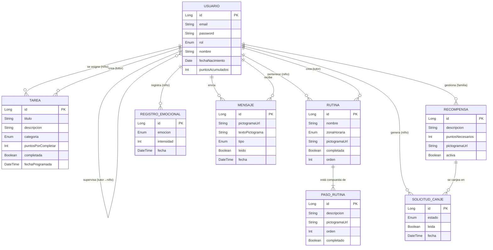

```mermaid
erDiagram

    %% ─── ENTIDADES Y ATRIBUTOS ───────────────────────────────────

    USUARIO {
        Long    id              PK
        String  email
        String  password
        Enum    rol
        String  nombre
        Date    fechaNacimiento
        Int     puntosAcumulados
    }

    TAREA {
        Long        id              PK
        String      titulo
        String      descripcion
        Enum        categoria
        Int         puntosPorCompletar
        Boolean     completada
        DateTime    fechaProgramada
    }

    RUTINA {
        Long    id              PK
        String  nombre
        Enum    zonaHoraria
        String  pictogramaUrl
        Boolean completada
        Int     orden
    }

    PASO_RUTINA {
        Long    id          PK
        String  descripcion
        String  pictogramaUrl
        Int     orden
        Boolean completado
    }

    RECOMPENSA {
        Long    id              PK
        String  descripcion
        Int     puntosNecesarios
        String  pictogramaUrl
        Boolean activa
    }

    SOLICITUD_CANJE {
        Long        id      PK
        Enum        estado
        Boolean     leida
        DateTime    fecha
    }

    REGISTRO_EMOCIONAL {
        Long        id          PK
        Enum        emocion
        Int         intensidad
        DateTime    fecha
    }

    MENSAJE {
        Long        id              PK
        String      pictogramaUrl
        String      textoPictograma
        Enum        tipo
        Boolean     leido
        DateTime    fecha
    }

    %% ─── RELACIONES ──────────────────────────────────────────────

    %% Un tutor supervisa a muchos niños y un niño puede tener varios tutores
    USUARIO ||--o{ USUARIO : "supervisa (tutor→niño)"

    %% Un niño tiene muchas tareas; un tutor crea muchas tareas
    USUARIO ||--o{ TAREA : "se asigna (niño)"
    USUARIO ||--o{ TAREA : "crea (tutor)"

    %% Un niño tiene muchas rutinas; un tutor crea muchas rutinas
    USUARIO ||--o{ RUTINA : "pertenece (niño)"
    USUARIO ||--o{ RUTINA : "crea (tutor)"

    %% Una rutina contiene muchos pasos
    RUTINA ||--|{ PASO_RUTINA : "está compuesta de"

    %% Un tutor/familia gestiona muchas recompensas
    USUARIO ||--o{ RECOMPENSA : "gestiona (familia)"

    %% Un niño realiza muchas solicitudes de canje
    USUARIO ||--o{ SOLICITUD_CANJE : "genera (niño)"

    %% Una solicitud referencia una recompensa
    RECOMPENSA ||--o{ SOLICITUD_CANJE : "se canjea en"

    %% Un niño genera muchos registros emocionales
    USUARIO ||--o{ REGISTRO_EMOCIONAL : "registra (niño)"

    %% Un usuario emite y recibe mensajes
    USUARIO ||--o{ MENSAJE : "envía"
    USUARIO ||--o{ MENSAJE : "recibe"
```
