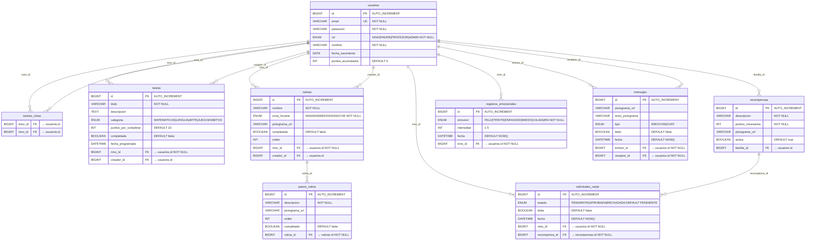

```mermaid
erDiagram
    %% ─── TABLAS PRINCIPALES ──────────────────────────────────────

    usuarios {
        BIGINT      id              PK  "AUTO_INCREMENT"
        VARCHAR     email           UK  "NOT NULL"
        VARCHAR     password            "NOT NULL"
        ENUM        rol                 "NINO|PADRE|PROFESOR|ADMIN  NOT NULL"
        VARCHAR     nombre              "NOT NULL"
        DATE        fecha_nacimiento
        INT         puntos_acumulados   "DEFAULT 0"
    }

    tutores_ninos {
        BIGINT      tutor_id        FK  "→ usuarios.id"
        BIGINT      nino_id         FK  "→ usuarios.id"
    }

    tareas {
        BIGINT      id              PK  "AUTO_INCREMENT"
        VARCHAR     titulo              "NOT NULL"
        TEXT        descripcion
        ENUM        categoria           "MATEMATICAS|LENGUA|ARTE|JUEGO|HABITOS"
        INT         puntos_por_completar "DEFAULT 10"
        BOOLEAN     completada          "DEFAULT false"
        DATETIME    fecha_programada
        BIGINT      nino_id         FK  "→ usuarios.id  NOT NULL"
        BIGINT      creador_id      FK  "→ usuarios.id"
    }

    rutinas {
        BIGINT      id              PK  "AUTO_INCREMENT"
        VARCHAR     nombre              "NOT NULL"
        ENUM        zona_horaria        "MANANA|MEDIODIA|NOCHE  NOT NULL"
        VARCHAR     pictograma_url
        BOOLEAN     completada          "DEFAULT false"
        INT         orden
        BIGINT      nino_id         FK  "→ usuarios.id  NOT NULL"
        BIGINT      creador_id      FK  "→ usuarios.id"
    }

    pasos_rutina {
        BIGINT      id              PK  "AUTO_INCREMENT"
        VARCHAR     descripcion         "NOT NULL"
        VARCHAR     pictograma_url
        INT         orden
        BOOLEAN     completado          "DEFAULT false"
        BIGINT      rutina_id       FK  "→ rutinas.id  NOT NULL"
    }

    recompensas {
        BIGINT      id              PK  "AUTO_INCREMENT"
        VARCHAR     descripcion         "NOT NULL"
        INT         puntos_necesarios   "NOT NULL"
        VARCHAR     pictograma_url
        BOOLEAN     activa              "DEFAULT true"
        BIGINT      familia_id      FK  "→ usuarios.id"
    }

    solicitudes_canje {
        BIGINT      id              PK  "AUTO_INCREMENT"
        ENUM        estado              "PENDIENTE|APROBADA|RECHAZADA  DEFAULT PENDIENTE"
        BOOLEAN     leida               "DEFAULT false"
        DATETIME    fecha               "DEFAULT NOW()"
        BIGINT      nino_id         FK  "→ usuarios.id  NOT NULL"
        BIGINT      recompensa_id   FK  "→ recompensas.id  NOT NULL"
    }

    registros_emocionales {
        BIGINT      id              PK  "AUTO_INCREMENT"
        ENUM        emocion             "FELIZ|TRISTE|ENFADADO|MIEDO|CALMA|IRA  NOT NULL"
        INT         intensidad          "1-5"
        DATETIME    fecha               "DEFAULT NOW()"
        BIGINT      nino_id         FK  "→ usuarios.id  NOT NULL"
    }

    mensajes {
        BIGINT      id              PK  "AUTO_INCREMENT"
        VARCHAR     pictograma_url
        VARCHAR     texto_pictograma
        ENUM        tipo                "EMOCION|CHAT"
        BOOLEAN     leido               "DEFAULT false"
        DATETIME    fecha               "DEFAULT NOW()"
        BIGINT      emisor_id       FK  "→ usuarios.id  NOT NULL"
        BIGINT      receptor_id     FK  "→ usuarios.id  NOT NULL"
    }

    %% ─── RELACIONES ──────────────────────────────────────────────

    usuarios        ||--o{ tutores_ninos        : "tutor_id"
    usuarios        ||--o{ tutores_ninos        : "nino_id"

    usuarios        ||--o{ tareas               : "nino_id"
    usuarios        ||--o{ tareas               : "creador_id"

    usuarios        ||--o{ rutinas              : "nino_id"
    usuarios        ||--o{ rutinas              : "creador_id"

    rutinas         ||--o{ pasos_rutina         : "rutina_id"

    usuarios        ||--o{ recompensas          : "familia_id"
    usuarios        ||--o{ solicitudes_canje    : "nino_id"
    recompensas     ||--o{ solicitudes_canje    : "recompensa_id"

    usuarios        ||--o{ registros_emocionales : "nino_id"

    usuarios        ||--o{ mensajes             : "emisor_id"
    usuarios        ||--o{ mensajes             : "receptor_id"
```
