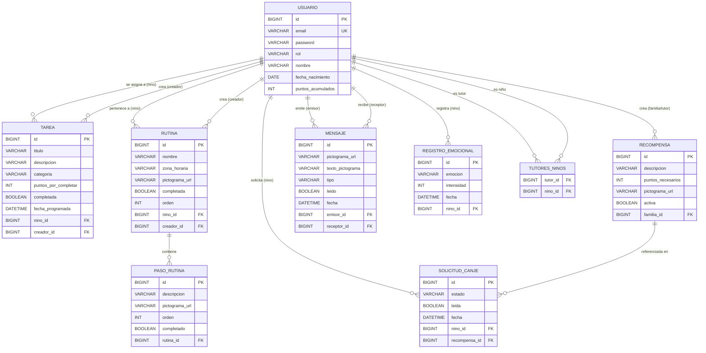
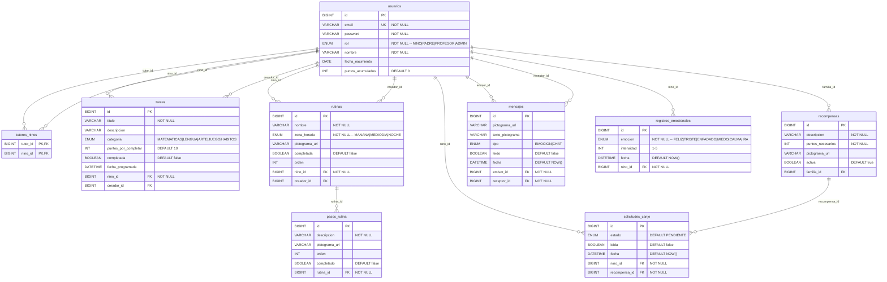

# Diagramas de Base de Datos — Apptism

---

## 1. Diagrama Entidad-Relación

---

## 2. Diagrama Relacional

---

## 3. Descripción de tablas

### `usuarios`
Entidad central del sistema. El campo `rol` determina el comportamiento de la aplicación: los usuarios `NINO` acumulan puntos, completan tareas y rutinas; los `PADRE` y `PROFESOR` crean y supervisan; el `ADMIN` gestiona el sistema.

### `tutores_ninos`
Tabla intermedia de la relación **ManyToMany** entre tutores y niños. Un tutor puede tener varios niños asignados y un niño puede tener varios tutores (padre y profesor simultáneamente).

### `tareas`
Tareas académicas o de hábitos asignadas a un niño (`nino_id`), creadas por un tutor (`creador_id`). Al completarse suman `puntos_por_completar` a `usuarios.puntos_acumulados`.

### `rutinas`
Rutinas diarias organizadas por zona horaria (mañana, mediodía, noche). Cada rutina pertenece a un niño y puede ser creada por él mismo o por su tutor.

### `pasos_rutina`
Pasos ordenados dentro de una rutina. Cada paso puede llevar un pictograma de ARASAAC y se marca completado de forma independiente.

### `recompensas`
Premios creados por un tutor (`familia_id`) que los niños pueden canjear gastando sus puntos acumulados.

### `solicitudes_canje`
Registra cada intento de canje de un niño. El tutor puede aprobar o rechazar la solicitud. Los estados son `PENDIENTE`, `APROBADA` o `RECHAZADA`.

### `mensajes`
Soporta dos flujos de comunicación: mensajes de chat bidireccional (`tipo = CHAT`) y envío de emociones del niño al tutor (`tipo = EMOCION`). Todos los mensajes usan pictogramas de ARASAAC.

### `registros_emocionales`
Historial de emociones registradas por un niño, con intensidad del 1 al 5. Permite al tutor consultar la evolución emocional semanal en forma de gráfico.

---

## 4. Restricciones y reglas de integridad

| Restricción | Descripción |
|---|---|
| `usuarios.email` | `UNIQUE NOT NULL` — no se permiten emails duplicados |
| `tutores_ninos (tutor_id, nino_id)` | `PRIMARY KEY` compuesta — evita vínculos duplicados |
| `tareas.nino_id` | `NOT NULL` — toda tarea debe tener un niño asignado |
| `rutinas.nino_id` | `NOT NULL` — toda rutina pertenece a un niño |
| `pasos_rutina.rutina_id` | `NOT NULL` con `CASCADE DELETE` — los pasos se eliminan con su rutina |
| `solicitudes_canje.estado` | `DEFAULT PENDIENTE` — estado inicial siempre pendiente |
| `mensajes.emisor_id / receptor_id` | `NOT NULL` — todo mensaje necesita emisor y receptor |
| `registros_emocionales.emocion` | `NOT NULL` — el campo emoción es obligatorio |
